# SKILL Autodub

Repository for the `video-target-subtitles` Codex skill.

[English](README.md) | [简体中文](README.zh-CN.md)

Current sealed release: `v1.0.0`

Detailed release note: [`docs/releases/v1.0.0.md`](docs/releases/v1.0.0.md)
Contribution guide: [`CONTRIBUTING.md`](CONTRIBUTING.md)
Next iteration plan: [`docs/plans/v1.0.1.md`](docs/plans/v1.0.1.md)

License: [MIT](LICENSE)

This skill generates localized subtitle deliverables from local video files or timed subtitle assets. It uses DashScope FunASR for ASR, an OpenAI-compatible chat completion API for translation, and exports clean `srt` / `vtt` files with:

- short emphasis cues preserved by default
- fragment-only semantic repair
- minimal punctuation in exported subtitles
- semantic line wrapping at standard line length
- `max-lines` treated as a warning-only review rule

## Workflow

```mermaid
flowchart LR
  A["Input video or timed subtitles"] --> B["Probe media and extract 16 kHz WAV"]
  B --> C["FunASR aggressive VAD transcription"]
  C --> D["Source rebalance: split long cues, preserve short beats"]
  D --> E["Semantic repair: fragment-only merges"]
  E --> F["Target translation"]
  F --> G["Timing polish"]
  G --> H["Export SRT or VTT: minimal punctuation + semantic wrapping"]
  H --> I["Lint"]
  F -. "Optional target-side cue splitting" .-> J["Target reflow"]
  J --> G
```



## Repository Layout

```text
SKILL_Autodub/
├── README.md
├── .gitignore
└── video-target-subtitles/
    ├── SKILL.md
    ├── VERSION
    ├── agents/
    ├── references/
    └── scripts/
```

`video-target-subtitles/` is the actual deployable skill folder.

## Deploy

### Option 1: Copy into your Codex skills directory

```bash
git clone https://github.com/zyzfred/SKILL_Autodub.git
mkdir -p "$CODEX_HOME/skills"
cp -R SKILL_Autodub/video-target-subtitles "$CODEX_HOME/skills/video-target-subtitles"
```

### Option 2: Symlink for local development

```bash
git clone https://github.com/zyzfred/SKILL_Autodub.git
mkdir -p "$CODEX_HOME/skills"
ln -s "$(pwd)/SKILL_Autodub/video-target-subtitles" "$CODEX_HOME/skills/video-target-subtitles"
```

After deployment, the folder should exist at:

```text
$CODEX_HOME/skills/video-target-subtitles
```

## Runtime Requirements

The skill expects:

- `ffmpeg`
- `ffprobe`
- Python 3
- `uv` recommended

Python dependencies:

```bash
uv pip install dashscope openai
```

You can also run bundled scripts ad hoc with:

```bash
uv run --with dashscope --with openai python ...
```

## Environment

Required for ASR:

- `DASHSCOPE_API_KEY`

Typical translation setup:

- `SUBTITLE_TRANSLATION_MODEL`
- `SUBTITLE_TRANSLATION_BASE_URL`

Common validated values:

```env
DASHSCOPE_API_KEY=...
DASHSCOPE_REGION=cn
FUNASR_MODEL=fun-asr-realtime-2026-02-28
SUBTITLE_TRANSLATION_MODEL=qwen3.5-flash-2026-02-23
SUBTITLE_TRANSLATION_BASE_URL=https://dashscope.aliyuncs.com/compatible-mode/v1
```

## Quick Verify

Check the deployed skill files:

```bash
ls "$CODEX_HOME/skills/video-target-subtitles"
```

Verify the bundled scripts compile:

```bash
python -m py_compile "$CODEX_HOME/skills/video-target-subtitles"/scripts/*.py
```

## Example Use

```text
Use $video-target-subtitles to generate English subtitles for /absolute/path/input.mp4.
```

## Release Notes

`v1.0.0` seals the first stable baseline with these defaults:

- preserve short emphasis cues
- merge only semantically incomplete source fragments
- export subtitles with minimal punctuation
- wrap long cues semantically instead of forcing extra cue splits by default

For the full release summary, validation snapshot, and accepted residual warnings, see [`docs/releases/v1.0.0.md`](docs/releases/v1.0.0.md).
