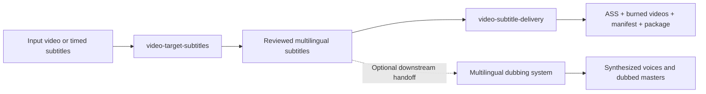

# SKILL Autodub

Repository for the `video-target-subtitles` and `video-subtitle-delivery` Codex skills.

[English](README.md) | [简体中文](README.zh-CN.md)

License: [MIT](LICENSE)

## Repository Scope

This repository now tracks a two-skill workflow for multilingual subtitle production and subtitle delivery:

- `video-target-subtitles` generates multilingual subtitle assets from local videos or timed subtitle files.
- `video-subtitle-delivery` packages approved subtitles into final delivery folders, styled `ASS`, burned videos, manifests, and optional zip archives.

This repository does not currently ship a dedicated speech-synthesis dubbing skill. Instead, it documents the handoff boundary for multilingual dubbing workflows: reviewed subtitles, stable timing JSON, batch summaries, and delivery manifests produced here can feed a downstream dubbing system without rerunning ASR or translation.

## Current Version Lines

Repository release tag: `v1.1.1`

| Skill | Version | Purpose |
| --- | --- | --- |
| `video-target-subtitles` | `v1.1.1` | Subtitle generation, localization, timing repair, OCR fallback, batch subtitle runs |
| `video-subtitle-delivery` | `v0.1.0` | Reviewed subtitle packaging, styled `ASS`, hard-burn output, delivery handoff |

Release notes:

- [`docs/releases/v1.1.1.md`](docs/releases/v1.1.1.md)
- [`docs/releases/video-target-subtitles-v1.1.1.md`](docs/releases/video-target-subtitles-v1.1.1.md)
- [`docs/releases/video-subtitle-delivery-v0.1.0.md`](docs/releases/video-subtitle-delivery-v0.1.0.md)
- Previous repository release: [`docs/releases/v1.1.0.md`](docs/releases/v1.1.0.md)
- Historical baseline: [`docs/releases/v1.0.0.md`](docs/releases/v1.0.0.md)

Contribution guide:

- [`CONTRIBUTING.md`](CONTRIBUTING.md)
- [`CONTRIBUTING.zh-CN.md`](CONTRIBUTING.zh-CN.md)

Versioning strategy:

- [`docs/versioning-strategy.md`](docs/versioning-strategy.md)
- [`docs/versioning-strategy.zh-CN.md`](docs/versioning-strategy.zh-CN.md)

Workflow overview:

- [`docs/workflow-overview.md`](docs/workflow-overview.md)
- [`docs/workflow-overview.zh-CN.md`](docs/workflow-overview.zh-CN.md)

Forward plan:

- [`docs/plans/v1.2.0.md`](docs/plans/v1.2.0.md)
- [`docs/plans/v1.2.0.zh-CN.md`](docs/plans/v1.2.0.zh-CN.md)

## Workflow



## Skill Boundaries

### `video-target-subtitles`

Use this skill when the task is still about subtitle production:

- extract speech-ready audio
- transcribe with DashScope FunASR and fall back to Qwen OCR when speech ASR fails
- translate while preserving timestamps
- export `srt` / `vtt`
- run batch subtitle generation with retry and summary artifacts

This skill intentionally stops before:

- styled `ASS`
- burn-in video rendering
- delivery package layout
- zip handoff packaging
- speech synthesis or dubbing audio generation

### `video-subtitle-delivery`

Use this skill only after subtitle QA is complete:

- convert reviewed subtitles into styled `ASS`
- burn subtitles into videos with `ffmpeg` / `libass`
- build deterministic delivery folders
- export `manifest.json`, delivery `README.md`, and optional zip archives

This skill intentionally does not do:

- ASR
- translation
- subtitle text rewriting
- timing recovery for unreviewed subtitle files
- speech synthesis or voice replacement

## Repository Layout

```text
SKILL_Autodub/
├── README.md
├── README.zh-CN.md
├── CONTRIBUTING.md
├── CONTRIBUTING.zh-CN.md
├── docs/
│   ├── releases/
│   └── plans/
├── video-target-subtitles/
│   ├── SKILL.md
│   ├── SKILL.zh-CN.md
│   ├── VERSION
│   ├── agents/
│   ├── references/
│   └── scripts/
└── video-subtitle-delivery/
    ├── SKILL.md
    ├── SKILL.zh-CN.md
    ├── VERSION
    ├── agents/
    ├── assets/
    ├── references/
    └── scripts/
```

Both `video-target-subtitles/` and `video-subtitle-delivery/` are deployable skill folders.

## Deploy

### Option 1: Copy both skills into your Codex skills directory

```bash
git clone https://github.com/zyzfred/SKILL_Autodub.git
mkdir -p "$CODEX_HOME/skills"
cp -R SKILL_Autodub/video-target-subtitles "$CODEX_HOME/skills/video-target-subtitles"
cp -R SKILL_Autodub/video-subtitle-delivery "$CODEX_HOME/skills/video-subtitle-delivery"
```

### Option 2: Symlink for local development

```bash
git clone https://github.com/zyzfred/SKILL_Autodub.git
mkdir -p "$CODEX_HOME/skills"
ln -s "$(pwd)/SKILL_Autodub/video-target-subtitles" "$CODEX_HOME/skills/video-target-subtitles"
ln -s "$(pwd)/SKILL_Autodub/video-subtitle-delivery" "$CODEX_HOME/skills/video-subtitle-delivery"
```

Expected deployed paths:

```text
$CODEX_HOME/skills/video-target-subtitles
$CODEX_HOME/skills/video-subtitle-delivery
```

## Runtime Requirements

Shared requirements:

- `ffmpeg`
- `ffprobe`
- Python 3
- `uv` recommended

Additional delivery requirement:

- `libass` support in `ffmpeg`

Python dependencies for subtitle generation:

```bash
uv pip install dashscope openai
```

You can also run bundled subtitle-generation scripts ad hoc with:

```bash
uv run --with dashscope --with openai python ...
```

The delivery skill does not require network access by default.

## Recommended Reading

- [`video-target-subtitles/SKILL.md`](video-target-subtitles/SKILL.md)
- [`video-target-subtitles/SKILL.zh-CN.md`](video-target-subtitles/SKILL.zh-CN.md)
- [`video-subtitle-delivery/SKILL.md`](video-subtitle-delivery/SKILL.md)
- [`video-subtitle-delivery/SKILL.zh-CN.md`](video-subtitle-delivery/SKILL.zh-CN.md)

## Quick Verify

Check the deployed skill folders:

```bash
ls "$CODEX_HOME/skills/video-target-subtitles"
ls "$CODEX_HOME/skills/video-subtitle-delivery"
```

Verify the bundled Python scripts compile:

```bash
python -m py_compile video-target-subtitles/scripts/*.py video-subtitle-delivery/scripts/*.py
```

## Example Requests

```text
Use $video-target-subtitles to generate English subtitles for /absolute/path/input.mp4.
Use $video-target-subtitles to generate Japanese subtitles for every video in /absolute/path/data.
Use $video-subtitle-delivery to package reviewed English subtitles in /absolute/path/output against the videos in /absolute/path/data.
```
