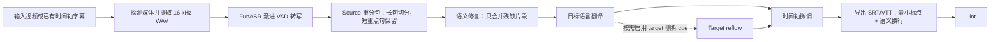

# SKILL Autodub

`video-target-subtitles` Codex skill 仓库。

[English](README.md) | [简体中文](README.zh-CN.md)

当前封版版本：`v1.0.0`

详细发布说明：[`docs/releases/v1.0.0.md`](docs/releases/v1.0.0.md)
贡献说明：[`CONTRIBUTING.md`](CONTRIBUTING.md)
下一轮计划：[`docs/plans/v1.0.1.md`](docs/plans/v1.0.1.md)

许可证：[MIT](LICENSE)

这个 skill 用于从本地视频文件或已有时间轴字幕资产生成目标语言字幕。它使用 DashScope FunASR 做 ASR，使用 OpenAI-compatible Chat Completions 做翻译，并导出干净的 `srt` / `vtt` 字幕文件，默认行为包括：

- 默认保留短重点句
- 只对语义残缺片段做 semantic repair
- 导出字幕默认使用最小标点
- 长句默认按语义换行，不强制拆成更多 cue
- `max-lines` 仅作为 warning，不作为强制优化目标

## 工作流



## 仓库结构

```text
SKILL_Autodub/
├── README.md
├── README.zh-CN.md
├── .gitignore
└── video-target-subtitles/
    ├── SKILL.md
    ├── VERSION
    ├── agents/
    ├── references/
    └── scripts/
```

其中 `video-target-subtitles/` 就是实际可部署的 skill 目录。

## 部署方式

### 方式 1：复制到 Codex skills 目录

```bash
git clone https://github.com/zyzfred/SKILL_Autodub.git
mkdir -p "$CODEX_HOME/skills"
cp -R SKILL_Autodub/video-target-subtitles "$CODEX_HOME/skills/video-target-subtitles"
```

### 方式 2：开发时使用软链接

```bash
git clone https://github.com/zyzfred/SKILL_Autodub.git
mkdir -p "$CODEX_HOME/skills"
ln -s "$(pwd)/SKILL_Autodub/video-target-subtitles" "$CODEX_HOME/skills/video-target-subtitles"
```

部署完成后，skill 目录应位于：

```text
$CODEX_HOME/skills/video-target-subtitles
```

## 运行依赖

系统依赖：

- `ffmpeg`
- `ffprobe`
- Python 3
- 推荐使用 `uv`

Python 依赖：

```bash
uv pip install dashscope openai
```

也可以按脚本临时运行：

```bash
uv run --with dashscope --with openai python ...
```

## 环境变量

ASR 必需：

- `DASHSCOPE_API_KEY`

典型翻译配置：

- `SUBTITLE_TRANSLATION_MODEL`
- `SUBTITLE_TRANSLATION_BASE_URL`

当前已验证的常见配置示例：

```env
DASHSCOPE_API_KEY=...
DASHSCOPE_REGION=cn
FUNASR_MODEL=fun-asr-realtime-2026-02-28
SUBTITLE_TRANSLATION_MODEL=qwen3.5-flash-2026-02-23
SUBTITLE_TRANSLATION_BASE_URL=https://dashscope.aliyuncs.com/compatible-mode/v1
```

## 快速校验

检查 skill 是否部署到位：

```bash
ls "$CODEX_HOME/skills/video-target-subtitles"
```

检查脚本是否可编译：

```bash
python -m py_compile "$CODEX_HOME/skills/video-target-subtitles"/scripts/*.py
```

## 使用示例

```text
Use $video-target-subtitles to generate English subtitles for /absolute/path/input.mp4.
```

## 发布说明

`v1.0.0` 封住了第一条稳定基线，默认规则包括：

- 保留短重点句
- 只合并语义残缺的 source 片段
- 导出字幕默认省略弱标点
- 长句优先语义换行，而不是默认拆成更多 cue

更完整的 release summary、验证结果和已接受残留项见：
[`docs/releases/v1.0.0.md`](docs/releases/v1.0.0.md)
